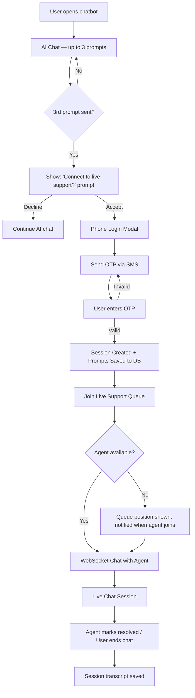
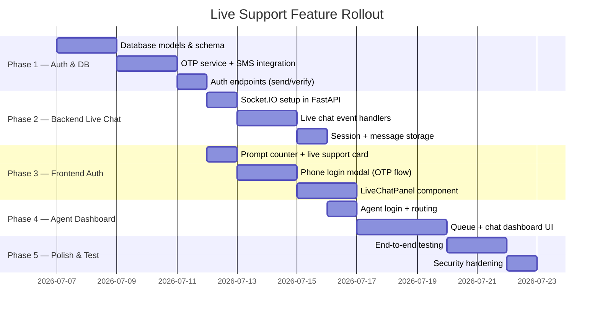

# Live Customer Support Feature — Implementation Plan

## Overview

Transform the existing ALO chatbot into a hybrid AI + live customer support platform. After 3 chatbot interactions, users are prompted to connect with a live support agent. Before connecting, users must authenticate via phone number (OTP). Authenticated sessions are stored, and users can chat in real-time with any available ALO support team member.

---

## Architecture Diagram



---

## Technology Requirements

### New Backend Dependencies

| Package                                | Purpose                                          |
| -------------------------------------- | ------------------------------------------------ |
| `python-socketio` + `python-multipart` | WebSocket-based real-time messaging              |
| `aiohttp` / `httpx`                    | Async HTTP for OTP provider                      |
| `sqlalchemy` + `aiosqlite`             | Persistent storage for users, sessions, messages |
| `python-jose` + `passlib`              | JWT-based session tokens                         |
| `twilio` _(or MSG91 / 2Factor)_        | SMS OTP delivery                                 |
| `alembic`                              | DB schema migrations                             |

### New Frontend Dependencies

| Package            | Purpose                         |
| ------------------ | ------------------------------- |
| `socket.io-client` | WebSocket connection to backend |
| `react-hot-toast`  | OTP/notification toasts         |

---

## Open Questions

> [!IMPORTANT]
> **OTP Provider**: Which SMS gateway do you prefer?
>
> - **Twilio** (international, paid) — most reliable globally
> - **MSG91** (India-focused, cost-effective) — great for Indian numbers
> - **2Factor.in** (India, cheap) — budget option
>
> The `.env` key names and API call format change based on this choice.

> [!IMPORTANT]
> **Database**: Do you want to use SQLite (file-based, zero setup) or PostgreSQL (production-grade)?
>
> - **SQLite** — easiest for local/single-server deployment
> - **PostgreSQL** — required if you plan to scale or have multiple server instances

> [!IMPORTANT]
> **Agent Dashboard**: Should the support agent dashboard be:
>
> - A **separate web page** (`/agent`) within this same project
> - A **separate standalone app**
>
> _Recommendation: Separate page in this project (simpler, no new repo)_

> [!WARNING]
> **OTP Cost**: Every login attempt sends a real SMS. Should we add a **resend cooldown** (e.g., 60 seconds) and a **max attempt limit** (e.g., 3 per hour) to prevent abuse?

---

## Proposed Changes

### Phase 1 — Database & Auth Layer

#### [NEW] `backend/database.py`

- SQLAlchemy async engine with SQLite (or Postgres)
- Tables: `users`, `chat_sessions`, `messages`, `support_agents`, `live_sessions`

#### [NEW] `backend/models.py`

- ORM models for all tables

#### [NEW] `backend/auth.py`

- `POST /auth/send-otp` — generate OTP, store in DB with expiry, send via SMS gateway
- `POST /auth/verify-otp` — validate OTP, return JWT token
- JWT token generation & verification helpers
- Rate limiting on OTP endpoints (max 3/hr per phone)

#### [NEW] `backend/otp_service.py`

- Abstracted SMS sending function (swap provider without touching auth.py)
- Supports Twilio / MSG91 / 2Factor

---

### Phase 2 — Session & Conversation Storage

#### [MODIFY] [main.py](file:///d:/ALOChatbot/backend/main.py)

- Register new auth & live-chat routers
- Integrate Socket.IO alongside existing FastAPI app (via `socketio.ASGIApp` wrapper)
- Add `/auth` and `/live` route prefixes

#### [MODIFY] [chatbot.py](file:///d:/ALOChatbot/backend/chatbot.py)

- Add `prompt_count` tracking per `session_id` (passed from frontend)
- After streaming a response, if `prompt_count >= 3`, inject a special SSE event: `{"type": "suggest_live_support"}`
- Store each user message + AI response to `messages` table if user is authenticated

#### [NEW] `backend/live_chat.py`

- Socket.IO event handlers:
  - `user_join_queue` — place user in waiting queue
  - `agent_join` — agent authenticates and becomes available
  - `agent_pick_user` — agent picks a user from the queue
  - `send_message` — relay message between user ↔ agent in real-time
  - `end_session` — save transcript, mark session as resolved
  - `user_disconnect` / `agent_disconnect` — handle graceful disconnects

#### [NEW] `backend/agent_auth.py`

- `POST /agent/login` — simple email+password login for support team members
- Agent JWT generation (separate role from user JWT)

---

### Phase 3 — Frontend: Auth Flow

#### [MODIFY] [Chatbot.jsx](file:///d:/ALOChatbot/frontend/src/components/Chatbot.jsx)

- Track `promptCount` state (resets on chat reset)
- After 3rd prompt's response arrives: render a **"Connect to Live Support?"** card (not just text — a styled Yes/No UI card)
- On "Yes": show **Phone Login Modal**
- **Direct Login / Logout Entry Points**:
  - Add a **"Login"** lock button (`🔒 Login`) in the chatbot header controls when the user is not logged in.
  - Add **"Live Chat"** (`🎧 Live Chat`) and **"Sign Out"** buttons in the chatbot header controls when the user is logged in.
  - Add a **"Live Support"** chip to the greeting home screen chips.
  - Intercept messages containing phrases like `live support`, `talk to agent`, `human agent`, or `login` in the user message box, triggering the live support/login modal directly instead of querying the LLM.

#### [MODIFY] [Chatbot.css](file:///d:/ALOChatbot/frontend/src/components/Chatbot.css)

- Add CSS styling for the login, logout, and live chat buttons in the header to match the brand guidelines (Poppins typography, HSL/gradient buttons, responsive hover micro-animations).
- Styles for `PhoneLoginModal`, `LiveChatPanel`, queue status card, OTP input boxes, live support prompt card.

---

### Phase 4 — Agent Dashboard

#### [NEW] `frontend/src/pages/AgentDashboard.jsx`

- Route: `/agent`
- Login screen (email + password)
- After login:
  - **Queue panel**: list of waiting users (name, wait time, last message preview)
  - **Active chats**: current open conversations
  - **Chat window**: real-time message exchange with selected user
  - **Resolve button**: close session and save transcript
- Connected via `socket.io-client` with agent JWT

#### [MODIFY] `frontend/src/main.jsx`

- Add React Router
- Routes: `/` → chatbot, `/agent` → agent dashboard

---

### Phase 5 — Data Storage Schema

```sql
-- Users (authenticated via OTP)
users (id, phone_number, name, created_at, last_seen)

-- All chatbot conversations (AI + live)
chat_sessions (id, user_id, started_at, ended_at, session_type: 'ai'|'live', status)

-- Individual messages in any session
messages (id, session_id, sender_role: 'user'|'bot'|'agent', content, timestamp)

-- Support agents (company team members)
support_agents (id, name, email, password_hash, is_online, created_at)

-- Live support pairings
live_sessions (id, user_id, agent_id, session_id, queue_position, status: 'waiting'|'active'|'resolved', started_at, resolved_at)
```

---

## Implementation Roadmap



---

## Verification Plan

### Automated Tests

- Unit tests for OTP generation, expiry, and JWT validation (`backend/tests/`)
- Socket.IO event tests with a mock agent and mock user

### Manual Verification

1. Open chatbot → send 3 messages → verify "Connect to Live Support?" prompt appears
2. Click Yes → verify phone modal opens → enter phone → receive OTP SMS → enter OTP → verify JWT is stored
3. Confirm user enters queue → verify queue position is shown
4. Open `/agent` → login as agent → pick user from queue → exchange messages in real-time
5. Agent resolves session → verify transcript saved in DB
6. Verify all prior AI chat messages for authenticated users are stored with correct session IDs

---

## Security Considerations

- OTP expires in **10 minutes**, max **3 retries** before lockout
- JWT tokens expire in **24 hours**, refreshed on activity
- Agent and user JWTs have **different roles** — agent endpoints verify agent role
- All Socket.IO connections require a **valid JWT** in the handshake auth header
- Phone numbers are **normalized** before storage (strips spaces, dashes, leading zeros)
- Rate limit: **3 OTP sends per phone per hour** to prevent SMS bombing
